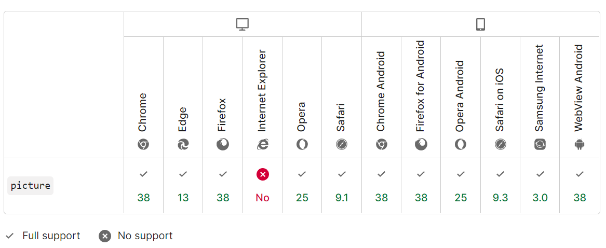

<h1 align="center">Elemento Picture HTML5</h1>

[](https://mellow-figolla-0b6465.netlify.app/)


```html
  <picture>
    <source media="(min-width: 768px)" srcset="desktop.png">
    <source media="(min-width: 500px)" srcset="tablet.png">
    
  </picture>
```

## Compatibilidade



Documentação: [MDN Docs](https://developer.mozilla.org/en-US/docs/Web/HTML/Element/picture)

[referência](https://eke.hashnode.dev/the-amazing-html5-picture-element)